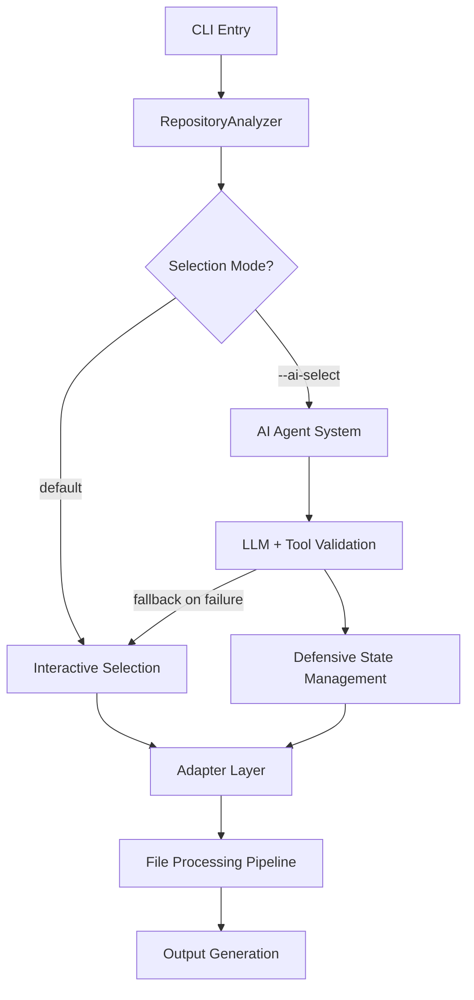

# Repo2Txt Architecture

**High-level system overview for understanding how components work together**

> For implementation details and design patterns, see [`SYSTEM_DESIGN.md`](SYSTEM_DESIGN.md)

## Overview

Repo2Txt is built around a **dual-workflow architecture** that handles both manual file selection and AI-assisted selection through a common processing pipeline. The system uses an adapter pattern to abstract different repository sources (GitHub, local directories) and employs defensive validation to ensure robust AI interactions.

**Core Philosophy**: Graceful degradation with intelligent error recovery. When AI selection fails, the system falls back to manual selection. When tool calls are invalid, the system provides structured feedback to both user and LLM for re-strategising.

The architecture prioritises **transparency** (users see what's happening) and **resilience** (failures don't crash the system, they become learning opportunities).

## System Flow



## Core Components

### **Entry & Orchestration**
- **`cli.py`**: Command-line interface and option parsing
- **`core/analyzer.py`**: Main orchestrator coordinating all workflows

### **Repository Abstraction**  
- **`adapters/base.py`**: Abstract interface for repository sources
- **`adapters/github.py`**: GitHub API integration with authentication
- **`adapters/local.py`**: Local filesystem access with encoding detection

### **AI Selection System**
- **`ai/file_selector_agent.py`**: Main AI coordinator
- **`ai/state.py`**: Defensive validation and token budget management
- **`ai/chat_orchestrator.py`**: Conversation flow with streaming responses
- **`ai/tools.py`**: Tool execution with error feedback loops

### **Processing Pipeline**
- **`core/file_analyzer.py`**: Content processing and token counting
- **`utils/console.py`**: Rich terminal UI with theme support
- **`utils/path_utils.py`**: Cross-platform path normalization utilities
- **`utils/tree_builder.py`**: Centralized FileNode tree construction

## Manual vs AI Workflows

| Aspect | Manual Selection | AI-Assisted Selection |
|--------|------------------|---------------------|
| **Entry Point** | `adapter.traverse_interactive()` | `FileSelectorAgent.chat_loop()` |
| **User Experience** | Directory navigation, real-time token feedback | Conversational file selection |
| **State Management** | Simple selection tracking | Complex state with undo/snapshots |
| **Error Handling** | Basic file access errors | Defensive tool validation + LLM feedback |
| **Fallback** | None (manual is the fallback) | Falls back to manual on AI failure |

**Convergence Point**: Both workflows end up calling the same `adapter.get_file_content()` methods and processing pipeline.

## Defensive AI Patterns

The AI system employs sophisticated error handling that goes beyond basic exception catching:

### **Tool Call Validation**
```python
# Every tool call is validated against repository structure
if path.strip() in self.available_files:
    valid_paths.append(path.strip())
else:
    invalid_paths.append(path.strip())
    
# Structured error feedback for LLM learning
feedback = (
    f"ERROR: {len(invalid_paths)} paths not found: {', '.join(invalid_paths)}. "
    f"Common issues: 1) Missing 'src/' prefix, 2) Wrong directory nesting. "
    f"Check repository structure and try again with corrected paths."
)
```

### **Error Feedback Loop**
1. **Tool fails** → Detailed error message generated
2. **Error sent to LLM** via conversation history (structured JSON)
3. **User sees immediate feedback** with actionable guidance
4. **LLM can re-strategise** based on specific error context
5. **System continues** rather than crashing

### **Graceful Degradation**
```python
# AI selection → Manual selection fallback
try:
    return self._ai_file_selection(adapter, repo_name, readme_content)
except Exception as e:
    print(f"[!] AI selection failed: {str(e)}")
    print("|>| Falling back to interactive selection...")
    return adapter.traverse_interactive()
```

## Key Design Decisions

### **Why Adapter Pattern?**
Enables seamless support for different repository sources without changing the core logic. Adding new sources (GitLab, S3, etc.) requires only implementing the adapter interface.

### **Why Session-Based AI Architecture?**
The `AgentSession` centralises state management, making the AI system testable and enabling features like undo/redo through state snapshots.

### **Why Defensive Tool Validation?**
LLMs make mistakes with file paths. Rather than failing silently, the system educates both user and LLM about the specific errors, leading to better subsequent attempts.

### **Why Real-Time Token Feedback?**
Users need immediate feedback about token budget usage. Both manual and AI workflows show live token counts to prevent budget overruns.

## Error Recovery Philosophy

**Traditional Approach**: "Fail fast, fail hard"
**Repo2Txt Approach**: "Fail informatively, recover gracefully"

- **File access errors** → Skip file, continue processing, report at end
- **Invalid tool calls** → Validate, provide structured feedback, allow retry
- **API failures** → Show specific error, allow user to continue conversation
- **AI system failure** → Automatic fallback to manual selection

## Extending the System

| To Add... | Look At... |
|-----------|------------|
| New repository source | `adapters/base.py` interface |
| New AI tool/capability | `ai/tools.py` registration system |
| New output format | `core/file_analyzer.py` generation logic |
| New LLM provider | `ai/llm.py` client abstraction |
| New validation rules | `ai/state.py` validation methods |

## Repository Adapter Implementations

While all adapters provide consistent interfaces and user experiences, their internal implementations differ significantly due to data source characteristics:

### Interactive Traversal Architecture Differences

**LocalAdapter (Real-time I/O Strategy)**
- **Data Source**: Direct filesystem access via `os.listdir(full_path)`
- **Token Counting**: Real-time computation via `file_analyzer.read_file_content() + count_tokens()`
- **Path Handling**: Filesystem manipulation using `os.path.relpath(item_path, self.repo_path)`
- **Item Processing**: Creates simple tuples `(item, 'dir'/'file')` from filesystem scan
- **Performance Profile**: I/O bound - reads files on demand during navigation
- **Memory Usage**: Low - processes individual files as user navigates

**GitHubAdapter (Pre-cached API Strategy)**
- **Data Source**: Pre-built tree via `_cached_file_tree + _path_to_node` lookup table
- **Token Counting**: Uses pre-computed `content.total_tokens` from initial API scan
- **Path Handling**: Direct use of `content.path` from GitHub API responses
- **Item Processing**: Creates `CachedContent` objects from `FileNode` children
- **Performance Profile**: Memory bound - entire repository structure loaded upfront
- **Memory Usage**: Higher - full repository tree cached in memory

### Why These Differences Exist

1. **API Constraints**: GitHub API requires batch operations for efficiency, while filesystem allows granular access
2. **Network Latency**: Pre-caching minimizes API calls during user interaction
3. **Rate Limiting**: GitHub API limits necessitate upfront bulk operations
4. **Data Availability**: Filesystem provides immediate access, API requires structured requests

### Implementation Consolidation Risk

**Note**: Despite identical user interfaces (`traverse_interactive()` methods), these implementations cannot be safely consolidated due to:

- **Fundamental data source differences** (filesystem vs API cache)
- **Token counting strategies** (real-time vs pre-computed)
- **Path manipulation approaches** (OS-specific vs API-normalized)
- **Performance characteristics** (I/O bound vs memory bound)


## Performance Characteristics

- **Token counting**: Cached per file content hash for efficiency
- **File loading**: Lazy loading - only selected files loaded into memory
- **AI responses**: Streaming for reduced perceived latency
- **GitHub API**: Efficient batching with rate limit awareness
- **Tree building**: Consolidated utilities eliminate duplicate implementations and ensure consistent hierarchical structures

---

**Next Steps**: 
- For implementation details → [`SYSTEM_DESIGN.md`](SYSTEM_DESIGN.md)
- For usage examples → [`../README.md`](../README.md)
- For troubleshooting → Check error messages (they're designed to be helpful!)
