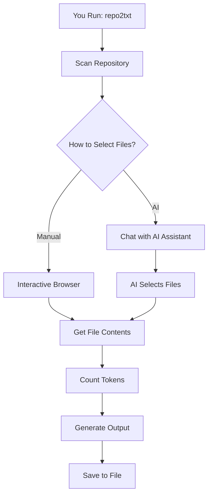

# Repo2Txt System Design

**A practical guide to how Repo2Txt works internally**

> **Quick Start**: Jump to [How It All Works Together](#how-it-all-works-together) for a simple overview, or [Common Scenarios](#common-scenarios) for practical examples.
> 
> **For Developers**: See [Implementation Details](#implementation-details) for code-level specifics.
> 
> **Architecture Overview**: Check [`ARCHITECTURE.md`](ARCHITECTURE.md) for the high-level picture.

## Table of Contents
1. [How It All Works Together](#how-it-all-works-together)
2. [Common Scenarios](#common-scenarios)
3. [Key Components Explained](#key-components-explained)
4. [AI System Deep Dive](#ai-system-deep-dive)
5. [Design Patterns We Use](#design-patterns-we-use)
6. [Error Handling Strategy](#error-handling-strategy)
7. [Performance & Optimisation](#performance--optimisation)
8. [Implementation Details](#implementation-details)

## How It All Works Together

### The Big Picture (5-Minute Version)

When you run Repo2Txt, here's what happens:

```
1. You give it a repo (GitHub URL or local path)
2. It scans all the files and builds a file tree
3. You choose files either:
   - Manually (browse and select interactively)
   - With AI help (chat about what you want)
4. It grabs the content of your selected files
5. It outputs everything in a nice format (Markdown/XML/JSON)
```

### The Flow in Detail



### What Each Step Does

1. **Repository Scanning**: Builds a complete file tree, calculates sizes, filters out unwanted files
2. **File Selection**: Either you navigate manually or describe what you want to an AI
3. **Content Retrieval**: Downloads/reads the actual file contents with proper encoding
4. **Token Counting**: Calculates how many tokens your selection will use in an LLM
5. **Output Generation**: Formats everything nicely for LLM consumption

## Common Scenarios

### Scenario 1: Manual Selection of a Local Project

```bash
repo2txt /path/to/my/project
```

**What happens:**
1. Scans your project directory
2. Shows you an interactive file browser
3. You navigate with arrow keys, select files with Space
4. Shows token count in real-time
5. Press 'g' to generate output when ready

**Behind the scenes:**
- `LocalAdapter` handles file system operations
- `ConsoleManager` provides the interactive UI
- Token counting happens instantly using cached calculations

### Scenario 2: AI-Assisted GitHub Repository

```bash
repo2txt https://github.com/user/repo --ai
```

**What happens:**
1. Downloads repo metadata via GitHub API
2. Starts AI chat session
3. You describe what you want: "I need the main Python files for a Flask API"
4. AI analyses the repo and suggests relevant files
5. You can refine the selection through conversation

**Behind the scenes:**
- `GitHubAdapter` handles API calls
- `FileSelectorAgent` coordinates the AI system
- `ChatOrchestrator` manages the conversation
- `StateManager` tracks which files are selected

### Scenario 3: Working with Large Repositories

```bash
repo2txt https://github.com/large/project --token-budget 100000 --ai
```

**What happens:**
1. AI is aware of your token budget (100k tokens)
2. It prioritises the most important files
3. Gives warnings when approaching the limit
4. Suggests alternatives if you go over budget

**Behind the scenes:**
- Real-time token calculation prevents overages
- Smart file prioritisation based on repository analysis
- Defensive validation ensures selections are valid

## Key Components Explained

### The Adapter System: One Interface, Multiple Sources

**Problem**: We need to handle GitHub repos and local directories differently
**Solution**: One common interface that works the same way

```python
# This works the same whether it's GitHub or local
adapter = create_adapter("https://github.com/user/repo")  # or "/local/path"
files = adapter.get_file_list()
content = adapter.get_file_content("src/main.py")
```

**Why this matters**: Adding support for GitLab, Bitbucket, or other sources just means creating a new adapter.

### The AI System: Structured Conversation Management

**Problem**: File selection can be complex - you might want "all Python files except tests" or "the main API components"
**Solution**: An AI agent that understands your repository and can have a conversation about file selection

**Key components:**
- **AgentSession**: Keeps track of the entire conversation and state
- **ChatOrchestrator**: Manages the back-and-forth conversation
- **StateManager**: Remembers which files are selected and tracks token usage
- **ToolExecutor**: Lets the AI actually select/deselect files

### State Management: Keeping Everything in Sync

**The Challenge**: As you select files (manually or with AI), we need to:
- Track which files are selected
- Calculate token usage in real-time
- Provide immediate feedback
- Handle undo operations
- Maintain consistency

**The Solution**: Centralised state with clear ownership:

```python
# All file selection state lives here
class FileSelectionState:
    selected_files: List[str]
    token_budget: int
    total_tokens_selected: int
    
    def get_budget_usage_percent(self) -> float:
        return (self.total_tokens_selected / self.token_budget) * 100
```

### Error Handling: Graceful Degradation

**Philosophy**: Things will go wrong, but the user should still be able to accomplish their goal.

**Examples:**
- GitHub API is down → Fall back to asking for a local clone
- AI selection fails → Fall back to manual selection
- Some files can't be read → Process the ones that can be read
- Invalid file paths → Show clear error messages and continue

## AI System Deep Dive

### How AI Selection Really Works

1. **Initial Analysis**: The AI gets a complete picture of your repository
   - File tree structure
   - README content
   - Repository metadata
   - Available files with token counts

2. **Conversation Loop**: You chat with the AI about what you want
   - "I need the core API files"
   - "Show me the authentication components"
   - "Add the database models but skip the tests"

3. **Tool Execution**: The AI uses "tools" to actually select files
   - It can add files, remove files, or replace the entire selection
   - Each action is validated against the actual repository structure
   - Token usage is calculated and reported immediately

4. **Validation & Feedback**: Every AI action is checked
   - Do the files actually exist?
   - Will this exceed the token budget?
   - Are there any issues the user should know about?

### The AI's "Tools" - What It Can Do

```python
# The AI can call these functions during conversation
def select_files(file_paths: List[str], reasoning: str):
    """Add files to the selection"""
    
def deselect_files(file_paths: List[str], reasoning: str):
    """Remove files from the selection"""
    
def replace_selection(file_paths: List[str], reasoning: str):
    """Replace entire selection with new files"""
    
def adjust_selection(add_paths: List[str], remove_paths: List[str], reasoning: str):
    """Add some files and remove others in one action"""
```

### Smart Error Recovery

The AI system doesn't just fail when things go wrong - it adapts:

```python
# If the AI tries to select a file that doesn't exist:
ERROR: File 'src/nonexistent.py' not found.
Available files starting with 'src/':
- src/main.py
- src/utils.py
- src/models/user.py
Common issues: 1) Missing directory prefix, 2) Typos in filename 3) Hallucination
```

This feedback goes back to the AI, which can then correct its mistake and try again.

## Design Patterns We Use

### Pattern 1: Adapter Pattern (For Repository Sources)

**What it does**: Lets us support different types of repositories (GitHub, local, etc.) with the same interface.

**Real example**:
```python
# This code works regardless of source
def process_repository(repo_source: str):
    adapter = create_adapter(repo_source)  # Figures out which type to use
    files = adapter.get_file_list()        # Same method for all types
    content = adapter.get_file_content("README.md")  # Same interface
```

**Why we use it**: Makes adding new repository types easy and keeps the code clean.

### Pattern 2: Session State Pattern (For AI Conversations)

**What it does**: Keeps all conversation state in one place, making it easy to manage and test.

**Real example**:
```python
# Everything related to one AI session is here
class AgentSession:
    def __init__(self):
        self.conversation_history = []
        self.selected_files = []
        self.token_usage = 0
        self.ai_client = LLMClient()
        
    def add_message(self, message):
        self.conversation_history.append(message)
        
    def select_file(self, path):
        self.selected_files.append(path)
        self.token_usage += calculate_tokens(path)
```

**Why we use it**: Makes state management predictable and enables features like undo.

### Pattern 3: Command Pattern (For User Commands)

**What it does**: Makes it easy to add new commands and handle them consistently.

**Real example**:
```python
# Adding a new command is just adding a method
class CommandHandler:
    def handle_command(self, command: str):
        if command.startswith('/save'):
            return self._handle_save()
        elif command.startswith('/undo'):
            return self._handle_undo()
        # Easy to add more...
```

### Simple Patterns: When NOT to Over-Engineer

**Format Selection**: We just use simple conditionals
```python
if format == 'xml':
    return f'<file>{content}</file>'
else:
    return f'```{filename}\n{content}\n```'
```

**Why not a Strategy pattern?** Because we only have 2-3 formats and they're simple. The added complexity isn't worth it.

## Error Handling Strategy

### The Three-Tier Approach

1. **Graceful Degradation**: Try to keep working even when things fail
2. **Clear Error Messages**: Tell users exactly what went wrong and how to fix it
3. **Fallback Options**: Provide alternatives when the primary approach fails

### Real Examples

**GitHub API Failure**:
```
[!] GitHub API failed: Rate limit exceeded
[→] Tip: Try again in 10 minutes, or clone the repo locally:
    git clone https://github.com/user/repo
    repo2txt ./repo
```

**AI Selection Failure**:
```
[!] AI selection failed: Invalid API key
[→] Falling back to interactive selection...
[Interactive file browser starts]
```

**Invalid File Paths**:
```
WARNING: 3 files could not be read:
  × src/deleted.py (File not found)
  × large_file.bin (File too large: 50MB > 1MB limit)
  × binary.exe (Binary file, skipping)
[→] Continuing with 15 valid files...
```

### Error Recovery for AI

When the AI makes mistakes, it gets detailed feedback:

```python
# Instead of just "File not found"
error_message = (
    f"ERROR: File '{path}' not found in repository. "
    f"Available files in '{dirname}': {similar_files}. "
    f"Common issues: 1) Wrong directory, 2) Typo in filename. "
    f"Please check the file tree and try again."
)
```

This helps the AI learn and make better suggestions.

## Performance & Optimisation

### Smart Token Counting

**The Problem**: Calculating tokens for every file on every selection is slow.
**The Solution**: Cache token counts and only recalculate when needed.

```python
# Calculate once, use many times
class TokenCache:
    def get_tokens(self, file_path: str, content: str) -> int:
        content_hash = hashlib.md5(content.encode()).hexdigest()
        if content_hash in self.cache:
            return self.cache[content_hash]
        
        tokens = self.tokenizer.count_tokens(content)
        self.cache[content_hash] = tokens
        return tokens
```

### Efficient File Loading

**Only load what you need**: Selected files are loaded on-demand, not all at once.
**Streaming**: Large outputs are streamed rather than built in memory.
**Parallel processing**: Multiple files can be processed simultaneously.

### Network Optimisation

**GitHub API**: Use efficient API calls and cache repository metadata.
**AI Requests**: Stream responses so users see output immediately.
**Concurrent operations**: Download multiple files in parallel when possible.

## Implementation Details

### Project Structure

```
src/repo2txt/
├── adapters/           # Handle different repository sources
│   ├── github.py       # GitHub API integration
│   ├── local.py        # Local filesystem access
│   └── base.py         # Common interface
├── ai/                 # AI-powered file selection
│   ├── agent_session.py    # Session management
│   ├── chat_orchestrator.py # Conversation handling
│   ├── tools.py            # AI function calling
│   └── state.py            # Selection state tracking
├── core/               # Main analysis engine
│   ├── analyzer.py         # Orchestrates everything
│   ├── file_analyzer.py    # Individual file processing
│   └── tokenizer.py        # Token counting
└── utils/              # Shared utilities
    ├── console.py          # Terminal UI
    ├── encodings.py        # File encoding detection
    └── file_filter.py      # File filtering logic
```

### Key Data Models

```python
@dataclass
class Config:
    """Main configuration - everything in one place"""
    github_token: str
    excluded_dirs: Set[str] = {'node_modules', '.git', '__pycache__'}
    max_file_size: int = 1024 * 1024  # 1MB
    output_format: str = 'markdown'
    token_budget: int = 50000

@dataclass
class AnalysisResult:
    """Results of repository analysis"""
    repo_name: str
    structure: str          # File tree as text
    selected_files: List[str]
    file_list: List[Dict]   # Detailed file information
    token_data: Dict[str, int]
    errors: List[str] = field(default_factory=list)
```

### Adding New Features

**New Repository Source** (e.g., GitLab):
1. Create `GitLabAdapter` inheriting from `RepositoryAdapter`
2. Implement the required methods (`get_file_list`, `get_file_content`, etc.)
3. Add detection logic to `create_adapter()` function

**New AI Tool**:
1. Define the tool schema in `tools.py`
2. Implement the tool function in `StateManager`
3. Register it in `ToolExecutor`

**New Output Format**:
1. Add format option to `Config`
2. Implement formatting logic in `FileAnalyzer`
3. Update CLI argument parsing

---

**Documentation Navigation:**
- **← Architecture Overview** → [`ARCHITECTURE.md`](ARCHITECTURE.md)  
- **← Usage Guide** → [`../README.md`](../README.md)
- **Contributing** → See main README for development setup