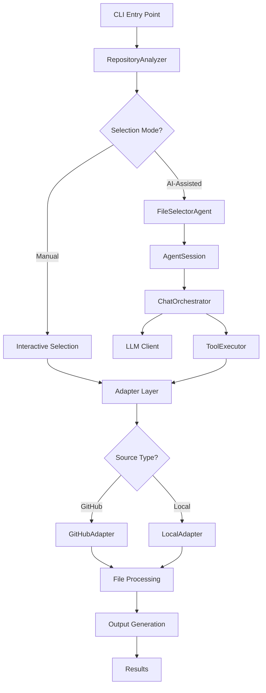

# Repo2Txt System Design

**Comprehensive technical documentation for implementation details, design patterns, and component interactions**

> This document provides deep technical details for contributors, researchers, and anyone needing to understand the internal workings of Repo2Txt's architecture.
> 
> **Start here if you need to**: Extend functionality, add new components, understand design patterns, or dive into implementation specifics.
> 
> For high-level understanding, see [`ARCHITECTURE.md`](ARCHITECTURE.md) first.

## Table of Contents
1. [Component Interactions & Data Flow](#component-interactions--data-flow)
2. [Design Patterns](#design-patterns)
3. [AI System Architecture](#ai-system-architecture)
4. [State Management](#state-management)
5. [Error Handling & Resilience](#error-handling--resilience)
6. [Performance Considerations](#performance-considerations)
7. [Implementation Details](#implementation-details)

## Component Interactions & Data Flow

### Detailed Architecture Flow



### 1. Entry Point & Orchestration

The flow begins at `cli.py`, which creates a `RepositoryAnalyzer` - the main orchestrator that coordinates all components:

- **CLI** → **RepositoryAnalyzer** → **Adapter Selection** (GitHub/Local)
- **Decision Point**: Manual vs AI-assisted file selection
- **Final Processing**: File content retrieval → Token counting → Output generation

### 2. Manual Selection Flow

```
RepositoryAnalyzer → Adapter.traverse_interactive() → ConsoleManager → User Input → Selected Files
```

**Process:**
1. User navigates directory structure interactively
2. Real-time token counting during selection
3. Direct file selection with immediate feedback
4. Validation and constraint checking

### 3. AI-Assisted Selection Flow

```
RepositoryAnalyzer → FileSelectorAgent → AgentSession → ChatOrchestrator → User Conversation
                                                    ↓
                                              ToolExecutor → StateManager → File Selection Updates
```

**Key AI Components Interaction:**

- **`FileSelectorAgent`**: Main coordinator, initialises all AI components
- **`AgentSession`**: Central state manager holding configuration, LLM client, and conversation history
- **`ChatOrchestrator`**: Manages conversation flow, streaming responses, command processing
- **`ToolExecutor`**: Executes AI function calls to select/deselect files
- **`StateManager`**: Tracks selected files, token usage, and maintains consistency

### 4. Adapter Layer Abstraction

Both selection modes converge on the adapter layer:

```
Selection Result → Adapter.get_file_contents() → File Analysis → Token Counting → Output
```

**Adapter Responsibilities:**
- **Source Abstraction**: Uniform interface for GitHub repos and local directories  
- **File Retrieval**: Efficient content fetching with encoding detection
- **Metadata Extraction**: Repository structure, README content, branch information

### 5. State Management in AI Mode

The AI system maintains complex state through several interconnected components:

- **`AgentSession`**: Session-level state (model config, UI console, debug settings)
- **`StateManager`**: File selection state with real-time token tracking
- **`MessageManager`**: Conversation history with system prompt management
- **`TokenCache`**: Performance optimisation for repeated token calculations

### 6. Real-Time Updates & Feedback

During AI selection, multiple components coordinate to provide immediate feedback:

```
User Input → LLM Response → Tool Calls → StateManager Updates → UI Feedback
                                    ↓
                               Token Calculations → Budget Warnings → Selection Validation
```

### 7. Output Generation Pipeline

Regardless of selection method, final processing follows a consistent pipeline:

```
Selected Files → FileAnalyzer → Content Processing → Token Analysis → Format Selection → File Output
                                        ↓
                               (Markdown/XML/JSON) → Structured Reports → File System
```

## Design Patterns

### 1. **Adapter Pattern** ✅ *Actually Implemented*
```python
# Abstract interface for repository sources
class RepositoryAdapter(ABC):
    @abstractmethod
    def get_file_list(self) -> List[str]
    
    @abstractmethod
    def get_file_content(self, path: str) -> Tuple[Optional[str], Optional[str]]
    
    @abstractmethod
    def traverse_interactive(self) -> Tuple[str, Set[str], Dict[str, int]]

# Concrete implementations
class GitHubAdapter(RepositoryAdapter):
    def get_file_content(self, file_path: str) -> Tuple[Optional[str], Optional[str]]:
        # GitHub API implementation
        
class LocalAdapter(RepositoryAdapter):
    def get_file_content(self, file_path: str) -> Tuple[Optional[str], Optional[str]]:
        # Local filesystem implementation
```

**Why this pattern?** Allows seamless support for different repository sources (local, GitHub, can be extended to other information sources)

**Factory Creation:**
```python
def create_adapter(repo_url_or_path: str, config: Config) -> RepositoryAdapter:
    if repo_url_or_path.startswith('https://github.com/'):
        return GitHubAdapter(repo_url_or_path, config)
    else:
        return LocalAdapter(repo_url_or_path, config)
```

### 2. **Session State Pattern** ✅ *Actually Implemented*
```python
class AgentSession:
    """Centralised session state with component coordination"""
    def __init__(self, config: SessionConfig, analysis_result: AnalysisResult, api_key: str):
        self.llm_client = LLMClient(api_key, config.model, config.base_url)
        self.state_manager = StateManager(analysis_result, config.token_budget)
        self.message_manager = MessageManager()
        self.tool_executor = ToolExecutor(self.state_manager)
```

**Why this pattern?** Encapsulates all session-related state and provides controlled access to components, making testing and state management much easier.

### 3. **Command Pattern** ✅ *Actually Implemented*
```python
class CommandHandler:
    def handle_command(self, command: str) -> bool:
        parts = command.split()
        cmd = parts[0].lower()
        args = parts[1:] if len(parts) > 1 else []
        
        command_map = {
            '/generate': self._handle_generate,
            '/save': self._handle_save,
            '/clear': self._handle_clear,
            '/undo': self._handle_undo,
            # ... more commands
        }
        
        if cmd in command_map:
            return command_map[cmd](args)
```

**Why this pattern?** Makes adding new commands trivial and enables features like undo/redo through state snapshots.

### 4. **Simple Conditional Patterns**

**Output Format Selection** - Straightforward conditional logic:
```python
if self.config.output_format == 'xml':
    content = f'<file path="{file_path}">\n{content}\n</file>\n'
else:  # markdown
    content = f"```{file_path}\n{content}\n```\n"
```

**LLM Provider Configuration** - OpenAI client with configurable base URL:
```python
# Configuration-based approach
client = OpenAI(api_key=api_key, base_url=base_url or "https://api.openai.com/v1")
```

**Why simple conditionals over Strategy patterns?**
- **YAGNI (You Aren't Gonna Need It)**: The current approach works fine for the limited scope
- **Premature abstraction**: Adding strategy patterns would over-engineer simple conditionals
- **Technical debt vs. real benefit**: The abstraction cost isn't justified by current requirements

### 5. **Other Points Worth Noting**

**Simple State Machine for AI Agent:**
```python
# AgentSession manages state transitions
def save_snapshot(self) -> None:
    self.state_snapshots.append((
        self.message_manager.get_messages().copy(),
        self.state_manager.state.selected_files.copy(),
        self.state_manager.state.total_tokens_selected
    ))

def restore_snapshot(self) -> bool:
    if not self.state_snapshots:
        return False
    messages, files, tokens = self.state_snapshots.pop()
    # Restore state...
```

**Observer-like Token Tracking:**
```python
class StateManager:
    def add_selected_files(self, file_paths: List[str]) -> Dict[str, Any]:
        for file_path in file_paths:
            if file_path not in self.state.selected_files:
                tokens = self._calculate_tokens(file_path)
                self.state.selected_files.append(file_path)
                self.state.total_tokens_selected += tokens
                # Real-time feedback to UI
```

**Configuration Object Pattern:**
```python
@dataclass
class Config:
    github_token: str = field(default_factory=lambda: os.getenv('GITHUB_TOKEN', ''))
    excluded_dirs: Set[str] = field(default_factory=lambda: {...})
    # Single source of truth for all configuration
```

## AI System Architecture

### Session Management

The AI system uses a session-based architecture centred around `AgentSession`:

```python
class AgentSession:
    """Centralised session state and component coordination"""
    def __init__(self, config: SessionConfig, analysis_result: AnalysisResult, api_key: str):
        self.llm_client = LLMClient(api_key, config.model, config.base_url)
        self.state_manager = StateManager(analysis_result, config.token_budget)
        self.message_manager = MessageManager()
        self.tool_executor = ToolExecutor(self.state_manager)
        # ... other components
```

### Conversation Flow

1. **Initialisation**: System prompt generation based on repository analysis
2. **User Input**: Command processing and message handling
3. **LLM Interaction**: Streaming responses with tool calling
4. **Tool Execution**: File selection operations via function calls
5. **State Updates**: Real-time token tracking and selection updates
6. **User Feedback**: Rich terminal output with progress indicators

### Tool Calling Architecture

```python
class ToolExecutor:
    """Executes AI tool calls for file selection"""
    def execute_select_files(self, file_paths: List[str]) -> Dict[str, Any]:
        # Validate selections
        # Update state
        # Calculate token impact
        # Return feedback
```

### Defensive Tool Validation System

The AI system implements sophisticated validation that goes beyond basic exception handling:

```python
def replace_selection(self, paths: List[str], reasoning: str) -> Dict[str, Any]:
    valid_paths, invalid_paths = [], []
    
    for path in paths:
        if path.strip() in self.available_files:
            valid_paths.append(path.strip())
        else:
            invalid_paths.append(path.strip())
    
    # Build detailed error feedback for LLM to learn from
    if invalid_paths and not valid_paths:
        feedback = (
            f"ERROR: None of the {len(invalid_paths)} paths were found in the repository. "
            f"Invalid paths: {', '.join(invalid_paths)}. "
            f"Please check the repository structure in the system prompt and correct these paths. "
            f"Common issues: 1) Missing 'src/' prefix, 2) Wrong directory nesting, 3) Typos in filenames. "
            f"Try again with corrected paths that exist in the shown file tree."
        )
```

## State Management

### Hierarchical State Structure

```
AgentSession (Root)
├── Configuration State
│   ├── Model settings
│   ├── Theme preferences  
│   └── Debug flags
├── Conversation State
│   ├── Message history
│   ├── System prompts
│   └── Tool call logs
├── Selection State
│   ├── Selected files
│   ├── Token calculations
│   └── Budget tracking
└── UI State
    ├── Display preferences
    ├── Streaming settings
    └── Progress indicators
```

### State Persistence

- **Snapshots**: Automatic state snapshots for undo functionality
- **Session Recovery**: Ability to restore previous session state
- **Configuration Persistence**: Settings saved across sessions

### File Selection State Management

```python
@dataclass
class FileSelectionState:
    """Holds the current file selection state."""
    selected_files: List[str] = field(default_factory=list)
    token_budget: int = 50000
    total_tokens_selected: int = 0
    previous_files: List[str] = field(default_factory=list)
    previous_tokens: int = 0
    
    def get_budget_usage_percent(self) -> float:
        return round((self.total_tokens_selected / self.token_budget) * 100, 3)
    
    def is_over_budget(self) -> bool:
        return self.total_tokens_selected > self.token_budget
```

## Error Handling & Resilience

### AI-to-Manual Fallback
```python
# Real fallback mechanism in analyzer.py
try:
    # AI-assisted selection
    structure, selected_paths, token_data = self._ai_file_selection(adapter, repo_name, readme_content)
except Exception as e:
    print(f"[!] AI selection failed: {str(e)}")
    if self.config.debug:
        traceback.print_exc()
    print("|>| Falling back to interactive selection...")
    structure, selected_paths, token_data = adapter.traverse_interactive()
```

### Defensive Tool Call Validation
```python
# StateManager validates every tool call and provides detailed feedback
def replace_selection(self, paths: List[str], reasoning: str) -> Dict[str, Any]:
    valid_paths, invalid_paths = [], []
    
    for path in paths:
        if path.strip() in self.available_files:
            valid_paths.append(path.strip())
        else:
            invalid_paths.append(path.strip())
    
    # Build detailed error feedback for LLM to learn from
    if invalid_paths and not valid_paths:
        feedback = (
            f"ERROR: None of the {len(invalid_paths)} paths were found in the repository. "
            f"Invalid paths: {', '.join(invalid_paths)}. "
            f"Please check the repository structure in the system prompt and correct these paths. "
            f"Common issues: 1) Missing 'src/' prefix, 2) Wrong directory nesting, 3) Typos in filenames. "
            f"Try again with corrected paths that exist in the shown file tree."
        )
    # Returns structured error data for both user and LLM
```

### Error Feedback Loop to LLM
```python
# Tool execution captures and feeds errors back through conversation history
async def _execute_tool_calls_and_update_history(self, tool_calls: List[ToolCall]):
    for tool_call in tool_calls:
        result = await self.tool_executor.execute_tool(tool_call)
        
        # Error content is structured for LLM learning
        if result.error:
            output_content = json.dumps({
                "error": result.error, 
                "details": str(result.output)
            })
        else:
            output_content = json.dumps(result.output) if result.is_json_output else str(result.output)
        
        # Add to conversation history so LLM sees its mistakes
        tool_results_for_history.append({
            "role": "tool", 
            "tool_call_id": result.tool_call_id, 
            "name": tool_call.tool_name, 
            "content": output_content  # Includes error details
        })
    
    # LLM receives full error context in next response
    self.message_manager.add_tool_results(tool_results_for_history)
```

### Intelligent Error Recovery
```python
# Tool errors provide actionable guidance, not just failure notices
if invalid_paths:
    feedback = (
        f"WARNING: {len(invalid_paths)} paths were not found: {', '.join(invalid_paths)}. "
        f"Please verify these paths against the repository structure and either: "
        f"1) Correct them if they were typos/mistakes, or 2) Remove them if they don't exist. "
        f"Use adjust_selection to add the corrected paths."
    )
```

**This creates a defensive feedback loop where:**
1. **Tool calls are validated** against repository structure 
2. **Errors include diagnostic info** (common mistakes, correction strategies)
3. **LLM receives structured error data** in conversation history
4. **User sees immediate feedback** about what went wrong
5. **LLM + User can re-strategise** based on the specific error context

### File-Level Error Tolerance
```python
# Continues processing when individual files fail
try:
    content, error = adapter.get_file_content(file_path)
    if error:
        failed_files.append((file_path, error))
        # Continues with other files
except Exception as e:
    self.errors.append(f"Error accessing {file_path}: {str(e)}")
    # Processing continues
```

### Basic Exception Boundaries
```python
# Chat orchestrator handles API errors
try:
    response_content, tool_calls = await self._get_ai_response()
except APIError as e:
    self.ui.print_error(f"OpenAI API Error: {e.code} - {e.message}")
    # User can continue chatting
except Exception as e:
    self.ui.print_error(f"Unexpected error: {e}")
    break  # Exits chat loop but doesn't crash application
```

### Error Collection & Reporting

The system collects errors for user visibility rather than attempting automatic recovery:

```python
# Errors are collected and reported, not retried
self.errors.append(f"Error accessing {path}: {str(e)}")

# At the end, errors are displayed to user
if result.has_errors():
    console.print(f"WARNINGS DETECTED: {len(result.errors)}")
    for error in result.errors[:5]:
        console.print(f"  > {error}")
```

This is **pragmatic error handling** - collect issues, show them to the user, and continue processing what can be processed. No fancy resilience patterns, just practical robustness.

## Performance Considerations

### Token Counting Optimisation

- **Caching**: Token calculations cached per file content hash
- **Lazy Calculation**: Tokens calculated only when needed
- **Batch Processing**: Multiple files processed together

```python
class StateManager:
    def __init__(self, analysis_result: AnalysisResult, token_budget: int = 50000):
        # Create lookup maps for fast validation
        self.available_files: Set[str] = {f['path'] for f in analysis_result.file_list}
        self.file_tokens: Dict[str, int] = {f['path']: f.get('tokens', 0) for f in analysis_result.file_list}
```

### Memory Management

- **Streaming**: Large file contents streamed rather than loaded entirely
- **Selective Loading**: Only selected files loaded into memory
- **Garbage Collection**: Explicit cleanup of large objects

### Network Optimisation

- **GitHub API**: Efficient use of API calls with caching
- **LLM Requests**: Streaming responses to reduce perceived latency
- **Concurrent Processing**: Parallel file processing where possible

## Implementation Details

### Module Structure

```
src/repo2txt/
├── adapters/           # Repository adapters (GitHub, local, etc.)
│   ├── base.py         # Abstract interface defining adapter contract
│   ├── github.py       # GitHub repository adapter with API integration
│   ├── local.py        # Local filesystem adapter with encoding detection
│   └── __init__.py     # Adapter factory and path resolution logic
├── ai/                 # AI-powered file selection system
│   ├── agent_session.py    # Session state management
│   ├── chat_orchestrator.py # Chat flow coordination  
│   ├── command_handler.py   # Command processing
│   ├── file_selector_agent.py # Main AI agent
│   ├── llm.py              # LLM client & streaming
│   ├── prompts.py          # System prompt generation
│   ├── qwen_utils.py       # Qwen model utilities
│   ├── state.py            # File selection state & token cache
│   └── tools.py            # AI function calling tools
├── core/               # Analysis engine
│   ├── analyzer.py         # Main analysis orchestrator
│   ├── file_analyzer.py    # Individual file processing
│   ├── models.py           # Core data structures
│   └── tokenizer.py        # Token counting utilities
└── utils/              # Shared utilities
    ├── console.py          # Terminal UI management
    ├── console_base.py     # Base console functionality
    ├── encodings.py        # File encoding detection
    ├── file_filter.py      # File filtering logic
    └── logging_config.py   # Logging configuration
```

### Key Data Structures

```python
@dataclass
class Config:
    """Main configuration object"""
    github_token: str = field(default_factory=lambda: os.getenv('GITHUB_TOKEN', ''))
    excluded_dirs: Set[str] = field(default_factory=lambda: {...})
    max_file_size: int = 1024 * 1024  # 1MB
    output_format: str = 'markdown'
    
@dataclass
class AnalysisResult:
    """Results of repository analysis"""
    repo_name: str
    structure: str
    selected_files: List[str]
    file_list: List[Dict[str, Any]]
    token_data: Dict[str, int]
    errors: List[str] = field(default_factory=list)
```

### Tool Registration System

```python
class ToolExecutor:
    def __init__(self, state_manager: StateManager):
        self._registered_tools: Dict[str, Tuple[Tool, Callable]] = {}
        self.state_manager = state_manager
        self._register_default_tools()
    
    def _register_default_tools(self):
        """Register the default set of tools for file selection."""
        self.register_tool(
            Tool(
                name="replace_selection",
                description="Replace the entire file selection with new paths",
                parameters={...}
            ),
            self.state_manager.replace_selection
        )
```

This system makes it trivial to add new AI capabilities by registering new tools with their corresponding functions.

---

**Documentation Navigation:**
- **← High-level overview** → [`ARCHITECTURE.md`](ARCHITECTURE.md)  
- **← Usage guide** → [`../README.md`](../README.md)
- **Contributing** → See main README for development setup and contribution guidelines 